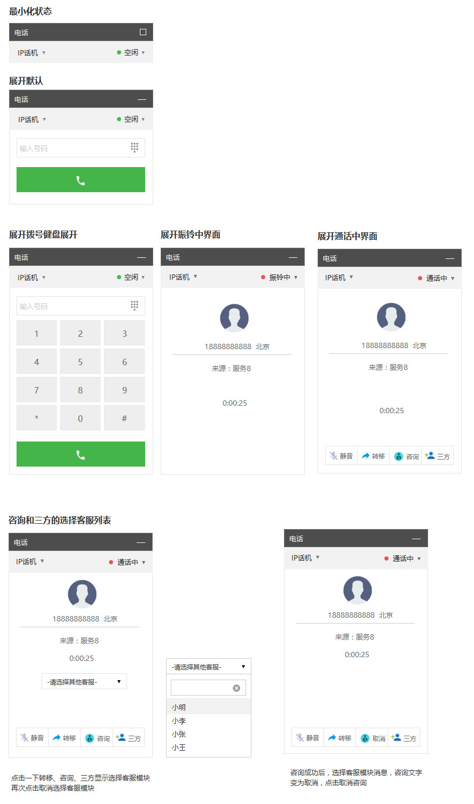

dist目录下是已经编译压缩以后的代码，可以直接放到你的项目里使用。
如果修改了我的代码，则需要先编译，编译方法在[这里](#user-content-如何编译)。

**!!!注意：通话组件和udesk系统只允许有一处存在，其中一处登录，会把另一处挤下线**



直接使用
----

#### 1、将dist目录下的内容引入你自己的项目，fonts目录拷贝到你的项目静态资源目录下。

```html
<!--  引入css-->
<link rel="stylesheet" type="text/css" href="./css/style.css">
<!--  引入js-->
<script src='./callcenter-component.js'></script>
```

#### 2、初始化组件

```html
<script>
var callComponent = new UdeskCallcenterComponent({
    container: document.body,    //组件的容器
    token: 'xxxxxxxx',           //通过登录接口获取的客服token，接口文档在doc/获取agent_api_token.md
    subDomain: 'udesk',           //在udesk注册的二级域名
    onScreenPop: function(conversation){},  //弹屏事件触发的方法
    onHangup: function(conversation){}
});
</script>
```

##### 弹屏事件(onScreenPop)

> 创建UdeskCallcenterComponent的时候传入onScreenPop。onScreenPop是一个方法，参数是[Object conversation](#conversation对象)

##### 挂断事件

> 创建UdeskCallcenterComponent的时候传入onHangup。onHangup是一个方法，参数是[Object conversation](#conversation对象)

##### conversation对象

属性名称|描述
----|----
conversation_id|通话记录ID
call_type|通话类型,只能是下列几个值之一，呼入、呼出、呼入（转接）、呼入（三方），呼入（咨询），呼入（强插），呼入（监听），呼入（强拆）
customer_phone_number|客户号码
queue_name|来源队列
customer_phone_location|归属地
agent_id|客服ID
agent_name|客服姓名
ring_time|振铃开始时间，例子：2017-03-09T14:34:24+08:00


#### 3、如何调用通话组件的外呼方法

```html
<script>
var phoneNumber = '18888888888';
callComponent.makeCall(phoneNumber);
</script>
```

浏览器适用情况
----
IE|firefox|chrome|safari|opera
---|------|------|------|-----
10|11|16|6|12.10


如何编译
----

#### 1、安装nodejs

[下载后安装](https://nodejs.org/zh-cn/download/)

#### 2、安装webpack

项目用webpack打包，需要先安装webpack
```
npm install -g webpack
```

#### 3、下载依赖

进入项目目录，运行下面的命令
```
npm install
```

#### 4、编译，打包，压缩

```
webpack
```


